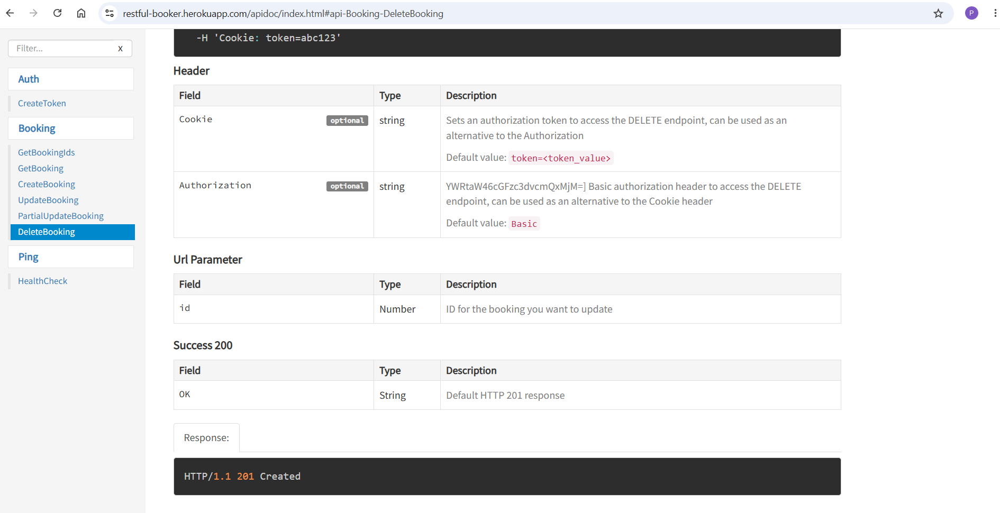
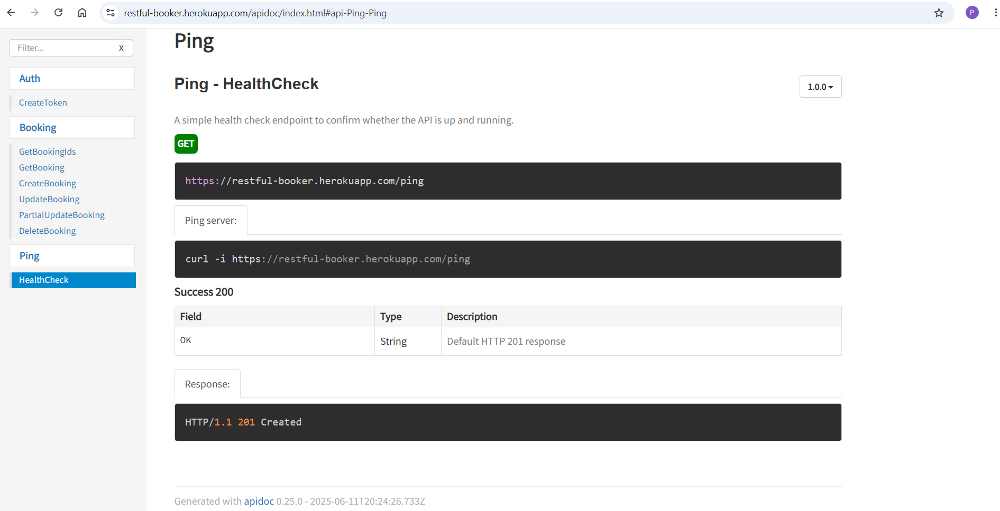

# BUG REPORTS - Restful Booker API

## BUG-001: Delete Booking endpoint documentation contains inconsistent success status codes

---

### Severity

Low

### Priority

Low

---

### Environment

- Production: https://restful-booker.herokuapp.com
- Endpoint: DELETE /booking/{id}
- Tools: Cypress / Postman

---

### Preconditions

- A valid booking must exist in the system
- A valid `bookingid` must be available
- Authentication token is required for delete operation

---

### Steps to Reproduce

1. Open the API documentation

2. Navigate to:
   DELETE /booking/{id}

3. Review the endpoint documentation

4. Observe that the endpoint is documented under:
   Success 200

5. Execute a DELETE request:

DELETE /booking/{bookingid}

6. Observe the returned HTTP status code and compare it with the documented response information

---

### Expected Result

- The documentation should consistently describe the expected success response status code
- All documented success responses for the endpoint should match the actual API behavior

---

### Actual Result

- The endpoint documentation contains inconsistent success response information
- The endpoint is documented under a success section while also presenting different response information within the same documentation
- This creates ambiguity regarding the expected response status code for successful deletion requests

---

### Evidence

- Documentation review of DELETE /booking/{id}
- Response status code verified through Cypress and Postman
- Booking is successfully deleted and subsequent GET request returns 404 Not Found
- Screenshot attached showing the documentation inconsistency



---

## BUG-002: Health Check endpoint documentation contains inconsistent success status codes

---

### Severity

Low

### Priority

Low

---

### Environment

- Production: https://restful-booker.herokuapp.com
- Endpoint: GET /ping
- Tools: Cypress / Postman

---

### Preconditions

- Restful Booker API documentation is accessible
- Health Check endpoint is available

---

### Steps to Reproduce

1. Open the API documentation

2. Navigate to:
   GET /ping

3. Review the endpoint documentation

4. Observe that the endpoint is documented under:
   Success 200

5. Review the response information displayed in the documentation

6. Execute a GET request:

GET /ping

7. Observe the returned HTTP status code

---

### Expected Result

- The documentation should consistently define a single expected success status code for the endpoint
- Documentation and actual API behavior should be aligned

---

### Actual Result

- The endpoint is documented under **Success 200**
- The same documentation page displays **Default HTTP 201 response**
- The actual API response returns **201 Created**
- Documentation is inconsistent and may mislead API consumers

---

### Evidence

- Documentation displays both **Success 200** and **Default HTTP 201 response**
- Cypress test TC07 confirms response status code **201 Created**
- Screenshot attached showing the documentation inconsistency



---

## BUG-003: API allows creation of booking with negative total price

---

### Severity

Medium

### Priority

High

---

### Environment

- Production: https://restful-booker.herokuapp.com
- Endpoint: POST /booking
- Tools: Cypress / Postman

---

### Preconditions

- API is available
- Valid booking payload is prepared

---

### Steps to Reproduce

1. Send POST request to:

POST /booking

2. Use request body containing:

"totalprice": -100

3. Submit the request

4. Observe the response

---

### Expected Result

- API should reject negative booking prices
- Validation error should be returned
- Booking should not be created

---

### Actual Result

- Booking is successfully created
- Response status code is 200 OK
- Negative value is accepted as total price

---

### Evidence

- Response status code: 200 OK
- Created booking contains negative total price value
- Booking ID returned in response
- Verified via Cypress / Postman

---

## BUG-004: API allows creation of booking with empty name fields

---

### Severity

Medium

### Priority

High

---

### Environment

- Production: https://restful-booker.herokuapp.com
- Endpoint: POST /booking
- Tools: Cypress / Postman

---

### Preconditions

- API is available
- Valid request body structure is prepared

---

### Steps to Reproduce

1. Send POST request to:

POST /booking

2. Use the following request body:

```json
{
  "firstname": "",
  "lastname": "",
  "totalprice": 150,
  "depositpaid": true,
  "bookingdates": {
    "checkin": "2026-06-20",
    "checkout": "2026-06-25"
  },
  "additionalneeds": "Breakfast"
}
```

3. Submit the request

4. Observe the response

---

### Expected Result

- Booking creation should require valid customer name information
- Empty `firstname` and `lastname` values should not be accepted
- Validation error should be returned
- Booking should not be created

---

### Actual Result

- Booking is successfully created
- Response status code is **200 OK**
- Empty `firstname` and `lastname` values are accepted by the API

---

### Evidence

- Response status code: 200 OK
- Booking created successfully with empty name fields
- Booking ID is generated and returned by the API
- Verified via Cypress / Postman

---

## BUG-005: API allows checkout date earlier than checkin date

---

### Severity

High

### Priority

High

---

### Environment

- Production: https://restful-booker.herokuapp.com
- Endpoint: POST /booking
- Tools: Cypress / Postman

---

### Preconditions

- API is available
- Valid booking payload is prepared

---

### Steps to Reproduce

1. Send POST request to:

POST /booking

2. Use the following request body:

```json
{
  "firstname": "Marko",
  "lastname": "Markovic",
  "totalprice": 150,
  "depositpaid": true,
  "bookingdates": {
    "checkin": "2026-06-30",
    "checkout": "2026-06-20"
  },
  "additionalneeds": "Breakfast"
}
```

3. Submit the request

4. Observe the response

---

### Expected Result

- The API should validate booking dates
- Checkout date must be later than checkin date
- Validation error should be returned
- Booking should not be created

---

### Actual Result

- Booking is successfully created
- Response status code is **200 OK**
- Checkout date earlier than checkin date is accepted

---

### Evidence

- Response status code: 200 OK
- Booking created successfully with invalid date range
- Verified via Cypress / Postman

---

## BUG-006: Authentication endpoint returns 200 OK for invalid credentials

---

### Severity

Medium

### Priority

Medium

---

### Environment

- Production: https://restful-booker.herokuapp.com
- Endpoint: POST /auth
- Tools: Cypress / Postman

---

### Preconditions

- API is available
- Authentication endpoint is accessible

---

### Steps to Reproduce

1. Send POST request to:

POST /auth

2. Use invalid credentials:

```json
{
  "username": "admin",
  "password": "wrongpassword"
}
```

3. Submit the request

4. Observe the response status code

---

### Expected Result

- The API should reject invalid credentials
- An authentication error status code should be returned (e.g. **401 Unauthorized**)
- Authentication failures should return an appropriate HTTP error status code

---

### Actual Result

- The API returns **200 OK**
- Response body contains:

```json
{
  "reason": "Bad credentials"
}
```

- Authentication failure is communicated only through the response body while the HTTP status code indicates a successful request

---

### Evidence

- Response status code: 200 OK
- Response body contains `"reason": "Bad credentials"`
- Verified via Cypress / Postman
